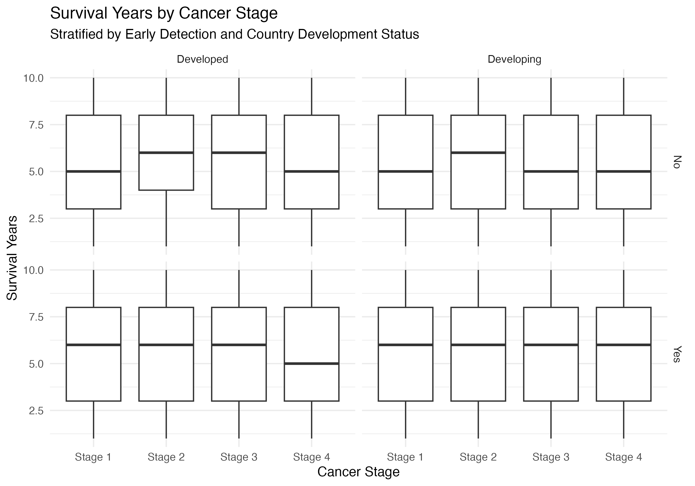

```{r setup, include=FALSE}
knitr::opts_chunk$set(echo = TRUE, warning = FALSE, message = FALSE)

library(dplyr)
library(knitr)
library(kableExtra)
library(broom)
```

Introduction

Lung cancer remains one of the leading causes of cancer-related mortality worldwide. Early detection and access to healthcare services are widely recognized as critical determinants of cancer outcomes. This dataset contains approximately 220,000 individual-level observations from 25 countries and includes demographic characteristics, smoking behavior, environmental exposures, cancer stage, healthcare access, and survival outcomes.

For this analysis, the dataset is restricted to individuals with a confirmed lung cancer diagnosis. The primary research question is: Among individuals diagnosed with lung cancer, how do early detection and healthcare access affect survival years, and does this relationship vary by cancer stage and country development status?

To address this question, I first estimate the overall (total) association between early detection, healthcare access, and survival. Next, I adjust for cancer stage to assess whether stage may mediate these associations. Finally, I test for effect modification by cancer stage and country development status using interaction terms. This structured modeling approach allows for a clearer understanding of both direct and indirect relationships affecting survival.

Table 1

```{r}
summary_table <- readRDS("output/table1.rds")

summary_table %>%
  kable(
    digits = 2,
    caption = "Table 1. Characteristics of Diagnosed Lung Cancer Patients by Early Detection Status"
  ) %>%
  kable_styling(full_width = FALSE)
```

Table 1 presents characteristics of individuals diagnosed with lung cancer stratified by early detection status. The table includes the number of individuals, mean age, mean survival years, and percentage diagnosed at advanced stages (Stage III or IV). This allows comparison of survival and stage distribution between those diagnosed early and those not diagnosed early.

Table 2

```{r}
model <- readRDS("output/model.rds")

tidy(model) %>%
  kable(
    digits = 3,
    caption = "Table 2. Linear Regression Model Predicting Survival Years"
  ) %>%
  kable_styling(full_width = FALSE)
```

This linear regression model estimates the association between early detection, healthcare access, cancer stage, and country development status with survival years. Interaction terms test whether the effect of early detection differs by cancer stage and whether it differs between developed and developing countries. Positive coefficients indicate longer survival, while negative coefficients indicate shorter survival.

Figure 1

```{r}

```

Results

Among individuals diagnosed with lung cancer, mean survival years were similar between those with early detection and those without early detection. In adjusted linear regression models, early detection and healthcare access showed limited evidence of strong association with survival years. Cancer stage and interaction terms help assess whether these patterns differ across disease severity and development status.

Conclusion

This analysis examined the relationship between early detection, healthcare access, cancer stage, and survival years among individuals diagnosed with lung cancer across 25 countries. Descriptive results and regression modeling suggest that survival is associated with broader clinical and contextual factors, while the observed effects of early detection and healthcare access appear modest in this dataset. Future analyses could incorporate additional covariates such as smoking intensity, environmental exposure, or use time-to-event survival methods for more advanced modeling.

